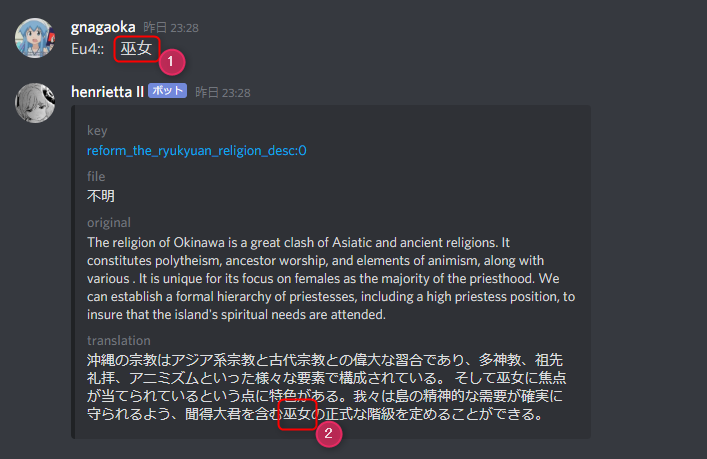
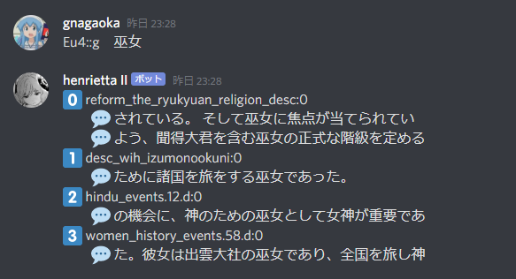

# Discord bot server

You can search for text in the translation data by talking to the [discord](https://discord.com/) bot.

(Single mode)



(List mode)



## How to use

### 1. Invite

Invite this bot to your discord server.Click this link.

> https://discord.com/api/oauth2/authorize?client_id=697306988685557841&permissions=2048&scope=bot

### 2. Commands common

```
Pdx:options
```

#### update Options

| Code | Description       |
|------|-------------------|
| l    | Update dictionary |

Example

```
Pdx:l
```

### 3. Commands

```
SearchPrefix::options search-word ...
```

Example

```
Eu4::gb 巫女　沖縄
```

#### SearchPrefix

See [paratranz2es](https://github.com/matanki-saito/paratranz2es) README.Lowercase and uppercase letters are
ignored.

#### Search Options

| Code   | Description |
|--------|-------------|
| a      | words AND   |
| (none) | words OR    |

#### Match Options

| Code | Description   |
|------|---------------|
| g    | list mode     |
| b    | Partial Match |

#### Source Options

| Code | Description                      |
|------|----------------------------------|
| t    | Search source is translated text |
| k    | Search source is key             |
| o    | Search source is original text   |

#### output Options

| Code   | Description |
|--------|-------------|
| g      | List        |
| r      | Aggregation |
| (none) | search      |

#### search options

| Code | Description        |
|------|--------------------|
| d    | translate by DeepL |

#### Search-word

If you list multiple words separated by spaces, the result is an AND search.Spaces are allowed in both half and
full-width spaces.

## Sequence


### Translators and paratranz

Volunteers translating in [paratranz](https://paratranz.cn/projects).

### paratranz2es

See [paratranz2es](https://github.com/matanki-saito/paratranz2es).

### Elasticsearch

Elasticsearch is a search engine.It is on EC2(ECS) of AWS.

### henrietta

This project.

### bot/channel and User

[Discord applications](https://discord.com/developers/applications) and users.

## Code documents

- [Schemaspy](https://matanki-saito.github.io/discordbot/schemadoc/)
- [Javadoc](https://matanki-saito.github.io/discordbot/javadoc/)

----