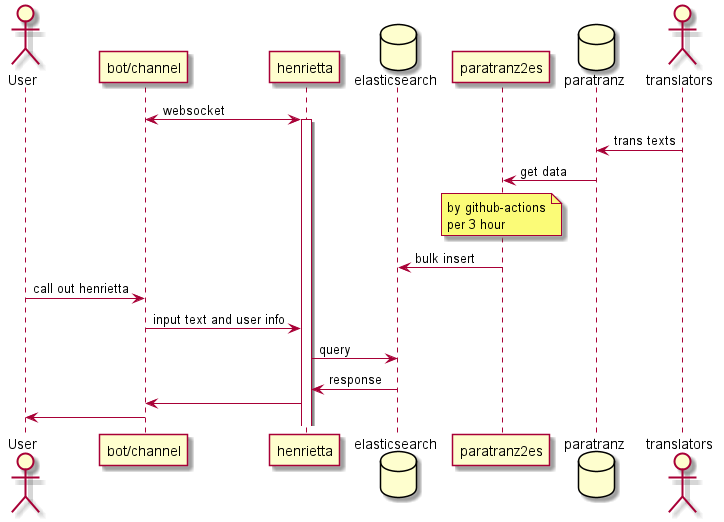

# Discord bot server
 
## sequence
 
 
 
## documents

 - [Schemaspy](https://matanki-saito.github.io/discordbot/schemadoc/)
 - [Javadoc](https://matanki-saito.github.io/discordbot/javadoc/)

## References

 - inserter.py: [paratranz2es](https://github.com/matanki-saito/paratranz2es)
 - paratranz: [paratranz](https://paratranz.cn/projects)
